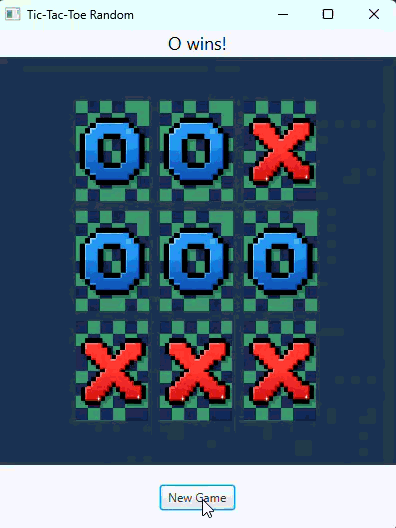

# TicTacToe-Game

Pixel Tic-Tac-Toe (JavaFX) A lightweight Tic-Tac-Toe game built with Java and JavaFX. It features custom pixel-art graphics and a randomized board generation system.  Tech Stack: Java 21, JavaFX, and Maven.  Key Features: Automated winner detection and custom resource management.

Pixel Tic-Tac-Toe Game

A simple and fun Tic-Tac-Toe game developed with Java and JavaFX, featuring charming pixel-art graphics and a randomized board generation system.

Features

**Pixel Art Style:** Enjoy custom X and O pixel graphics.
**Randomized Board:** Generates a new board with random X's and O's on each "New Game" click.
**Win/Tie Detection:** Automatically detects and announces winners or ties.
**Clean UI:** A straightforward JavaFX interface.

 Prerequisites
-   Java 21 or newer
-   Maven
